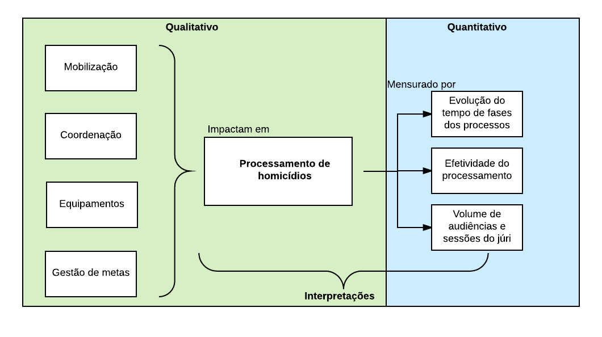
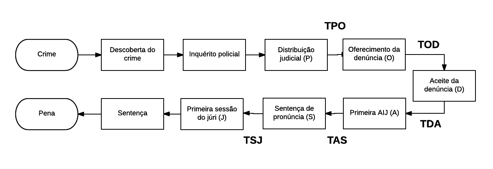
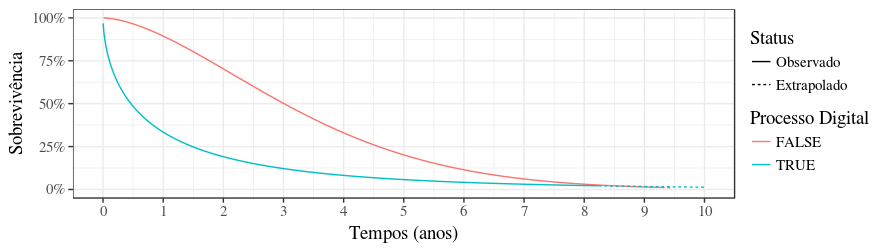

---
output:
  word_document:
    reference_docx: template.docx
    fig_caption: true
vignette: >
  %\VignetteIndexEntry{Relatório executivo SENASP}
  %\VignetteEngine{knitr::rmarkdown}
  %\VignetteEncoding{UTF-8}
---

```{r echo=FALSE}
knitr::opts_chunk$set(echo = FALSE, warning = FALSE, message = FALSE)
```

# Introdução

O Brasil é o país recorde em homicídios no mundo. Somamos quase 60 mil homicídios dolosos em 2014 e temos uma taxa 29,1 homicídios por 100 mil habitantes, 369% maior que a taxa mundial (ONU, 2015). Diante da importância do tema, é imprescindível utilizar dados empíricos para planejar e implementar políticas públicas.

Investigar o fluxo do processamento de homicídios desde o descobrimento do crime até a execução da pena é uma tarefa necessária para identificar o perfil dos homicídios e as boas e más práticas adotadas. Infelizmente, nenhum órgão brasileiro produz esses dados sistematicamente. A única estatística disponível sobre resolução de homicídios é o porcentual de inquéritos denunciados, com uma taxa nacional de 8% (ENASP, 2012). 

A Estratégia Nacional de Segurança Pública (ENASP) foi criada fevereiro de 2010 para solucionar o problema da coleta e monitoramento de dados e para atingir metas de produtividade consideradas essenciais. As metas envolvem a identificação das causas de subnotificação nos crimes de homicídio, conclusão dos inquéritos e procedimentos investigativos e finalização das ações penais em curso.

Neste trabalho, avaliamos a implementação e o impacto da ENASP, descrevendo suas dificuldades e conquistas. Além disso, utilizamos técnicas para obtenção automática de dados em três Unidades Federativas e estimamos o tempo dos processos de homicídio por fase. Finalizamos com um diagnóstico geral do problema e um cardápio de sugestões para aprimorar o sistema de segurança pública no Brasil.

##### Page Break

## O processamento de homicídio

### Funções da pena

O dever do Estado de investigar com devida diligência, julgar e sancionar os responsáveis pelo cometimento de crimes graves está fundamentado nas funções sociais do processamento penal. O produto último da persecução penal, a sentença, reúne dois elementos essenciais para a sociedade: i) a decisão sobre qual versão dos fatos será adotada como verdadeira e ii) a definição da pena do perpetrador. 

O estabelecimento da verdade sobre os fatos tem valor social atendendo os direitos à verdade e à memória daqueles afetados pelo homicídio. Já a pena tem diversas funções (Machado; Machado, 2013), dentre as quais destacamos seis:

1. retributiva, que visa punir quem cometeu o crime. Sua utilidade é questionada pelas ausências de impactos positivos para a sociedade e futuros para o indivíduo que cumpre a pena. 

1. manter o perpetrador afastado do convívio em sociedade, sendo que somente deveria ser aplicada a indivíduos com reais chances de reincidência em crimes graves ou violentos. 

1. A terceira função, reabilitadora da pena, se refere à eliminação das condicionantes que teriam levado o perpetrador a cometer o crime, como falta de acesso à educação ou atendimento médico; esta função, em regra, é deficientemente desenvolvida no nosso sistema de execução penal. 

1. Para a sociedade que testemunha aplicação de pena, há outras funções como a dissuasão, que faria com que a sociedade passasse a temer a pena e considerá-la um aumento de custo perante a oportunidade de cometer um crime (Nóbrega; Zaverucha; Rocha, 2009). 

1. A denunciação seria a comunicação à sociedade que a regra violada continua válida. 

1. A sexta função, ainda com pouco alcance no Brasil, é de caráter restaurativo no reestabelecimento da ordem anterior pela reparação dos danos ou reestabelecimento do tecido social. 

##### Page Break

### O processo de homicídio

O Código de Processo Penal brasileiro estabelece um prazo entre 296 e 316 dias para o completo processamento de um homicídio (RIBEIRO et al., 2014), desde o descobrimento do crime até a sentença do júri, sem contabilizar recursos. Em geral, o fluxo começa com a notificação de um cidadão gerando o deslocamento da Polícia Militar para o local do crime. Constatado o homicídio, a equipe policial deve preservar a cena e solicitar atendimento da Polícia Civil que deve conduzir a perícia e a identificação de possíveis testemunhas e suspeitos no local.

É registrado o boletim de ocorrência e a Polícia Civil passa a coletar informações para compor o inquérito policial com provas de autoria e materialidade. As diligências mais recorrentes são: interrogatório de suspeitos, depoimento de testemunhas e análise de provas técnicas, como do corpo, da arma e gravações de câmeras de vigilância. Há diligências específicas, como quebras de sigilo, que prescindem de autorização judicial. O prazo para finalização do inquérito é de 30 dias se não houver suspeito preso e de 10, se houver1, sendo que prorrogações devem ser solicitadas ao Ministério Público.  

O relatório resultante é distribuído2 e o promotor designado analisa se foram consideradas todas as linhas de investigação plausíveis, podendo solicitar diligências adicionais, denunciar o suspeito ou arquivar o caso. Esta decisão é encaminhada ao juiz designado que anui ou discorda, podendo devolver o processo ao Ministério Público para nova análise. Em caso de aceite da denúncia, tem início a fase judicial.

É preciso que o acusado nomeie um advogado ou solicite um defensor público. Com as partes constituídas, são mobilizados laudos e testemunhas para a Audiência de Instrução de Julgamento (AIJ). Nesta ocasião as provas são apresentadas e o acusado depõe. Desde 2008, há a possibilidade de que o juiz dê a sentença na própria audiência, podendo decretar i) absolvição, ii) desclassificação do crime, iii) impronúncia e iv) pronúncia para prosseguir com o julgamento. 

Em caso de pronúncia o processo vai para julgamento em Plenário ou Júri, onde testemunhas e provas são apresentadas pelas partes, o acusado é ouvido, defesa e acusação debatem e os jurados votam sobre: materialidade, autoria, participação, absolvição, causas de diminuição ou qualificação do crime. Em caso de condenação, a partir desta votação é fundamentada a sentença do juiz de qual a pena a ser cumprida. 

##### Page Break

### Gargalos

Existem cinco principais gargalos no processamento de homicídio, destacados abaixo.

1. **Cooperação e comunicação**. O Brasil está sujeito a desigualdades regionais e, apesar de ser necessário comportar particularidades locais, o processamento também prescinde de uma base mínima comum. Boa parte dos gargalos identificados está relacionada à falta de cooperação e coordenação entre as instituições (COSTA, 2015) e ao olhar fragmentado para um fluxo cujas etapas são interdependentes.

1. **Falta de dados**. Apesar de a Secretaria Nacional de Segurança Pública (SENASP) vir empreendendo esforços para construir um sistema nacional de estatística criminal, os dados estaduais ainda não são padronizados e divulgados sistematicamente para um grande leque de crimes. São raros os sistemas integrados entre polícias, entre secretarias estaduais ou entre poderes, indicadores de processo e esforço acessíveis publicamente. A dificuldade se estende até a estatísticas básicas como quantidade de inquéritos relatados, denunciados, processos julgados, prazos e resultados. 

1. **Fase policial**. A maior falha identificada encontra-se nas provas técnicas e na excessiva dependência de provas testemunhais. Existem deficiências na formação de policiais que não preservam a cena de maneira apropriada e relatos generalizados de falta de recursos adequados. Como consequência, temos uma média nacional de resolução de denúncias estimada em 8% em 2010 (ENASP, 2012). Parte dos problemas poderia ser mitigada com a qualificação dos policiais, acesso a ferramentas tecnológicas e bases de dados estaduais e federais interoperáveis. Outras soluções incluem:
    1. **Força Nacional**. Uma medida paliativa disponível é a requisição estadual de membros da Força Nacional de Polícia Judiciária e Técnico-Científica, que reúne profissionais de todo o país deslocados para auxiliar equipes locais por tempo pré-determinado.
    1. **Delegacias especializadas**. As delegacias permitem maior especialização pela prática acumulada e por treinamentos direcionados, e apresentam desenhos organizacionais diferentes, podendo desenvolver fluxos mais eficazes para o padrão da sua região. 

1. **Ministério público**. Entre as dificuldades identificadas na atuação do Ministério Público estão i) a frequência com que promotores solicitam diligências inespecíficas e ii) o incompleto exercício de controle da atividade policial, no que se refere tanto a possíveis irregularidades no decorrer do processamento quanto aos excessos de prazo. 

1. **Fase judicial**. A maior dificuldade identificada é a morosidade. Uma referência neste tema é a pesquisa realizada pelo CRISP em 2014 (RIBEIRO et al., 2014) que analisou retrospectivamente a duração de fases do processamento de homicídios que chegaram à sentença do júri em 5 capitais brasileiras: Belém, Belo Horizonte, Goiânia, Porto Alegre e Recife. Nesses casos, foram identificadas medianas entre 60 e 231 dias para a fase de inquérito cujo prazo processual é entre 10 e 30 dias. Na fase de denúncia, cujo prazo previsto é de 15 dias, as medianas ficaram entre 14 e 56 dias. O prazo entre aceite da denúncia e a realização da AIJ é de 60 dias, mas a mesma pesquisa identificou medianas entre 147 e 456 dias. Em relação ao período entre pronúncia e decisão do júri, as medianas ficaram entre 386 e 1.209 dias (3,3 anos) resultando em médias de tempo total (da descoberta do crime à sentença do júri) entre 2.058 a 3.403 dias (entre 5,6 e 9,3 anos) evidenciando a concentração da morosidade na fase judicial.

Ambas as fases, policial e judicial, têm problemas de *qualidade* e *morosidade*. A questão da qualidade chama mais atenção na fase policial por impor um gargalo nos casos que terão acesso à denúncia. Já a morosidade afeta mais o judiciário, prejudicando a capacidade de resolução pela dificuldade em coletar provas e localizar testemunhas e réus.

## A Estratégia Nacional de Justiça e Segurança Pública 

A ENASP foi resultado de uma mobilização conjunta do Ministério da Justiça (MJ), Conselho Nacional de Justiça (CNJ) e Conselho Nacional do Ministério Público (CNMP). Os representantes nacionais destes órgãos promoveram reuniões de trabalho para identificar os pontos do fluxo de processamento dos homicídios que concentravam maiores dificuldades. Identificados estes pontos sensíveis, passaram ao planejamento de ações específicas e, ainda conjuntamente, definiram metas para cada um destes pontos.

No primeiro momento foram separados três eixos, dos quais apenas o primeiro é de interesse na presente pesquisa1. As metas deste eixo foram revistas em julho de 2010 e são descritas no Quadro 1.

<!-- quadro -->


Não há relatórios ou prestação de contas pública a respeito das Metas 1 e 5. Pela falta de documentação e pelo relato de alguns gestores, podemos concluir que elas acabaram sendo informalmente abandonadas.

O primeiro relatório de execução da Meta 2 foi apresentado em 2012 com um cumprimento nacional de 32%, mas variando entre 100 e 3% entre os estados. Além dos resultados quantitativos, esse relatório trouxe extensas análises das principais dificuldades relatadas pelos gestores, recomendações e indicações de próximos passos. O relatório das Metas 3 e 4 foi mais modesto trazendo apenas as porcentagens de cumprimento de cada estado e a média nacional de 52% para a Meta 3 de alcançar a fase de pronúncia e de 57% para a Meta 4 de alcançar o julgamento no júri.

Apesar das primeiras metas não terem sido integralmente cumpridas, as metas de conclusão de inquéritos evoluíram automaticamente para se referirem aos inquéritos concluídos em 2008 e 2009 e novas metas foram estabelecidas para a fase judicial, a serem cumpridas até o fim de 2015:

- Julgar (em júri) 80% ou mais das ações de crimes dolosos contra a vida iniciadas até 2009 e que não haviam sido julgadas até 31 de outubro de 2014, e não se encontravam suspensas.
- Julgar (em júri) 50% ou mais das ações de crimes dolosos contra a vida iniciadas até 2009 (denúncia recebida) e que se encontravam suspensas no dia 31 de outubro de 2014.
Iniciar o cumprimento da pena de condenação transitada em julgado em 80% ou mais das ações de crimes dolosos contra a vida, julgadas até 2013 e não iniciadas em março de 2015.

Em setembro de 2016 ainda não havia relatório disponível sobre as metas definidas em 2015. Fomos informados de que a previsão é de publicação ainda em 2016. Enquanto isso, o mecanismo público de acompanhamento chamado "processômetro" (cuja alimentação pode não ser precisa) registra 20% de cumprimento1.

A partir de 2016, a ENASP passou por uma mudança importante no perfil de suas metas. Inicialmente, houve a tentativa de criá-las para o processamento prioritário de homicídios cometidos por motivos fúteis, utilizando o local de crime como filtro. No entanto, este recorte não se mostrou viável dada a fragilidade e não interoperabilidade das informações constantes nos registros sobre as ocorrências. A temática alternativa escolhida foi o feminicídio tendo como primeiro passo o levantamento de todos os casos de feminicídio e homicídios femininos ocorridos desde março de 2015. A proposta é que todos estes passem por uma revisão para verificar a pertinência de serem convertidos para feminicídios e tenham sua tramitação priorizada. Em paralelo a essa atividade, o CNMP elaborou um banco de dados detalhado sobre processos de violência doméstica, que serão coletados a partir do final de 2016. Alguns gestores da ENASP mencionaram o desejo de incluir nesta nova meta uma frente maior de comunicação social, esclarecimento sobre o crime e estímulo à denúncia da violência de gênero ainda em suas fases iniciais. Apesar da meta estar em avançado estágio de implementação, ainda não foi definido nenhum indicador de resultado nem de esforço.

##### Page Break

## Resultados

A pesquisa adotou dois métodos qualitativos e dois quantitativos que se complementam: i.1) entrevistas com gestores e operadores da ENASP, i.2) análise dos relatórios e documentos produzidos pela equipe da ENASP, ii.1) análise de uma amostra de processos de homicídios da comarca de São Paulo e ii.2) análise de dados gerais de amostras ou da totalidade de processos de homicídio que tramitaram nos estados de Alagoas, Santa Catarina e São Paulo entre 2009 e 2015. 

A parte qualitativa traz como resultado inicial um catálogo dos possíveis efeitos da ENASP como um todo organizado em quatro categorias: i) mobilização; ii) coordenação; iii) material e iv) gestão de metas. Já a parte quantitativa tem foco na mensuração de três elementos: i) tempos de algumas fases do processo de homicídio; ii) eficácia dos processos (percentuais de denúncias e pronúncias) e iii) quantidades de audiências e sessões do júri. A Figura 3 esquematiza a ideia utilizada para união e comparação das duas formas de análise. 

```{r metodologia, fig.cap='Esquema da utilização das metodologias qualitativa e quantitativa.'}

```

##### Page Break

### Estudos de caso

A pesquisa sobre a ENASP em seu âmbito federal identificou que a Estratégia teve sua implementação realizada de forma diversa entre as unidades da federação. Somado a isto o fato de que os estados também apresentam contextos diversos em seus sistemas de segurança e justiça, a pesquisa aprofundou a análise sobre a ENASP em três estados de contextos diversos, com vistas a identificar como a Estratégia impactou o processamento de homicídios em sua execução prática e também se resultou em ganhos permanentes para os estados.

##### Page Break

### Tempos dos processos

Analisamos uma amostra de todos processos em curso de 2009 a 2015 nos estados de Alagoas, Santa Catarina e São Paulo, incluindo todos casos que apresentaram alguma movimentação nesses anos, abrangendo aqueles distribuídos antes de 2009. A listagem dos processos foi obtida a partir da construção de robôs para leitura automática dos Diários de Justiça Eletrônicos (DJEs) dos três estados escolhidos e posterior extração dos processos nos sistemas de cada tribunal. 

A Figura 5 mostra o fluxo de processamento de homicídio de acordo com os tempos levantados:

```{r fluxo2, fig.cap='Fluxo resumido do processo de homicídio com inclusão dos tempos de interesse.'}

```

Os tempos foram estudados a partir de técnicas de Análise de Sobrevivência (MILLER; RUPERT, 2011), uma área da estatística que estuda dados com informações parciais.

a Tabela \@ref(tab:tempos) apresenta todos os tempos estimados de forma resumida. Podemos concluir que a fase judicial do processamento de homicídio está apresentando melhoras significativas nos três estados. No entanto, não é possível isolar o efeito da ENASP de outros efeitos, como a digitalização dos processos e criação de varas especializadas.

```{r tempos}
tab <- head(cars)
pander::pander(tab, caption = 'Tempos medianos (em dias) de cada fase dos processos ao longo dos anos. O TJSC não apresenta medidas para TPO, TOD e TDA e o TJAL não apresenta para TOD.')
```

Outro resultado relevante foi a identificação do efeito dos processos digitais. A Figura \@ref(fig:digital) mostra a sobrevivência do TPO para processos físicos e digitais no TJAL. Podemos observar diminuição significativa nos tempos dos processos digitais, que pode estar associada a maior facilidade de trânsito de informações entre policiais, juízes, defesa e promotoria, elemento mencionado por entrevistados, mas também pode ser fruto de alguma característica dos processos eletrônicos, tais como vieses geográficos ou temporais.

```{r digital, fig.cap='Curvas de sobrevivência dos tempos dos processos digitais e físicos.'}

```

##### Page Break

### Amostra

##### Page Break

### Diagnóstico

Com base nas análises quantitativas e qualitativas desta pesquisa, concluímos que se a Estratégia fosse julgada apenas pelo cumprimento de metas sua avaliação seria negativa. Várias metas não possuem relatórios ou documentação, os porcentuais de cumprimento são baixos e se referem a metas brandas, definidas para abarcar a diversidade de situações existentes nos entes da federação. 

O porcentual de cumprimento da Meta 2 alusivo aos inquéritos de 2007 alcançou 76% em 2016, se referindo a inquéritos abertos já há dez anos. Em 2012 (prazo inicial) estava em apenas 32%. Foi destaque nesta meta o fato do porcentual de denúncias do estoque ser de 19%, superior à média nacional de 8%, sendo que se referia a inquéritos antigos, mas ensejaria análise mais detida e qualitativa para ser interpretado se indica melhora na qualidade desses inquéritos ou benefício imediato dos mutirões e forças-tarefa, por definição, transitórios. É preciso mencionar também que essa média nacional de 8% foi obtida com dados precários e deve ser considerada apenas como referência. 

Não existem relatórios das Metas 1 e 5 e o da meta de 2015 ainda não fora publicado em setembro de 2016, constando no processômetro um cumprimento de 20%. A Meta 31 teve porcentual de cumprimento de 52% e a Meta 42, de 57%; para ambas não há relatórios analíticos disponíveis. 

No entanto, a ENASP foi além de suas metas e gerou valor para a sociedade desde sua formulação. O fato de três atores estatais de nível federal (CNJ, CNMP e MJ) terem se unido para o enfrentamento do crime de homicídio reforçou a mensagem de que este é um problema nacional, de responsabilidade compartilhada. Ao levantar dados nacionais, realizar diagnósticos sobre as principais dificuldades e definir metas comuns com os estados, provocou articulação entre as instituições envolvidas, definiu uma diretriz comum a ser perseguida e induziu a gestão por resultados, elementos fundamentais e ainda escassos no campo da segurança e da justiça criminal. Importa destacar também que ao criar ferramentas públicas de acompanhamento de resultados, a ENASP ajudou a fortalecer a prestação de contas do trabalho das polícias e dos atores do sistema de justiça à população, tendo importante efeito pedagógico para as instituições envolvidas e a sociedade.

Os estudos de caso demonstraram haver diferença no impacto da ENASP sobre a eficiência do processamento de homicídios, de acordo com variações de contexto estadual e intensidade com que as metas e demais atividades da ENASP foram implementadas. Em Santa Catarina e São Paulo, a ENASP apresentou efeito reduzido, podendo ter impactado principalmente nas fases após a primeira audiência. Já em Alagoas, impactos relevantes foram identificados tanto na fase entre a distribuição e o oferecimento da denúncia, quanto na capacidade de conversão de inquéritos em denúncias.

Em relação à análise de tempos, foi possível identificar redução sistemática nos tempos medianos ao longo dos anos. Em Alagoas, o efeito é mais perceptível na fase de investigação e provavelmente se trata de uma consequência direta da ENASP. Nos outros estados também observamos aceleração dos processos, mas não é clara uma atribuição direta à Estratégia. Uma exceção pode ser a fase entre pronúncia e júri, cuja aceleração pode apontar para um resultado da implementação anual das Semanas do Júri, além de iniciativas estaduais, como criação de uma vara especializada em SC. Em nenhum dos locais foi identificado efeito negativo da ENASP. 

As capacitações e o desenvolvimento de POPs foram bem avaliados pelos gestores e operadores, indicando que há demanda por políticas indutoras nos estados, mesmo que essas atividades sejam realizadas de forma inconstante. Diante dessa demanda dos estados por mais capacitações e orientações, sugestões viáveis incluem potencializar os momentos de relatoria e prestação de contas para ativar um canal de orientações do grupo gestor federal, assim como intercalar capacitações e reuniões presenciais e à distância.

Com relação aos pontos negativos, o principal foi a dispersão dos trabalhos. A partir de 2014, as reuniões se tornaram mais escassas e a documentação foi insuficiente. A queda do fôlego também pôde ser percebida na análise de volume de audiências, que apresentou esforço inicial brando, mas foi abandonado em menos de um ano. Em uma das entrevistas foi explicitado: "não é institucionalizada a ENASP, é Estratégia [...] depende das pessoas que estão a frente, esse é o grande problema", reflexão que instiga a considerar, inclusive, se outros instrumentos de formalização poderiam alavancar esta institucionalização. 

Ficou claro nas entrevistas que o grau de engajamento e liderança exercido por cada uma das instituições, no nível federal e estadual, tem impacto direto na implementação da ENASP. Ter uma equipe gestora federal que divulga periodicamente o andamento, cobra resultados e direciona demandas de forma rápida também se mostrou determinante. Observou-se diferença no engajamento das instituições federais ao longo do tempo, com destaque ao MJ no início e ao CNMP nos últimos anos. Apesar de não ser necessariamente desvantagem, no caso da ENASP ocasionou certa passividade dos demais envolvidos. Para recuperar o engajamento federal integral (e obter seu reflexo nos estados), seria importante retomar as reuniões e prestações de contas com periodicidade fixa e reduzir a rotatividade dos líderes nacionais e estaduais.

Também teve impacto no grau de engajamento das instituições a existência de metas específicas que envolvessem cada uma delas. No momento atual, por exemplo, a Polícia Civil se encontra um pouco afastada dado ao fato de sua meta ter apenas informalmente evoluído automaticamente estando desde 2012 sem progredir para especificidades (como a do Judiciário evoluiu para processos suspensos) e sem gerar nenhuma forma de prestação de contas ou de envolvimento formal. Este é um fato que precisaria ser sanado dado que esta pesquisa, tanto nas entrevistas quando na análise da amostra de São Paulo, corroborou que a fase policial é o principal gargalo quantitativo para o processamento de homicídios e concentra diversos pontos que poderiam ser trabalhados pela ENASP.

Apesar de ter um núcleo comum em torno dos homicídios, a ENASP desenvolveu muitos eixos temáticos relacionados que demandaram energia sem apresentar resultados, como as Metas 1 e 5 e a lista de alterações processuais que teriam sido abandonadas. Entre as atividades paralelas às metas que se desenvolveram, além da promoção de formações e criação de POPs já mencionados, merece destaque a promoção das Semanas do Júri que, apesar de paliativas, consistem em momento de articulação entre as instituições judiciais que pode ser potencializado.

Um destaque negativo que contrasta com a indução de uma política pública pautada pela gestão de resultados foi a falta de documentação, sistematização e avaliação da ENASP em nível nacional, impedindo uma avaliação mais ampla da iniciativa. É recomendado que a ENASP aprimore não apenas sua documentação interna e a alimentação dos inqueritômetro e processômetro, mas também a publicidade dos resultados para a sociedade de forma ativa e mais acessível, sendo exemplo prático da compreensão de que o fluxo do processamento começa na comunicação da ocorrência pela população e termina apenas com a resposta estatal dada a esta mesma população. Recuperando seu propósito inicial de reduzir a impunidade dos homicídios no Brasil, seria fundamental criar e alimentar uma ferramenta que meça e publique periodicamente a evolução deste indicador. 

##### Page Break

## Cardápio de soluções

Com base nas conclusões levantadas e na importância social do adequado processamento dos homicídios, listamos onze sugestões para aprimoramento da ENASP ou de novas atividades que auxiliem a evolução do processamento de homicídios no Brasil, em quatro eixos: administrativo, estratégico, tecnológico e acadêmico.

### Eixo administrativo

1. Retorno à rotina de realização de reuniões do grupo federal com periodicidade fixa, eventualmente intercalando eventos presenciais e à distância.

1. Estímulo ao retorno da realização de reuniões periódicas dos grupos gestores estaduais completos. Um momento propício para retomar essas reuniões pode ser logo depois das Semanas do Júri, que se mantém ativas como focos de coordenação e já incluem a Defensoria, atualmente marginalizada na ENASP.

1. Criação e ampla divulgação de um canal de atendimento e orientações do grupo gestor federal sobre a Estratégia e o processamento de homicídios. 

1. Maior coordenação entre as metas da ENASP e as metas próprias de cada um dos órgãos que a compõem (CNJ, CNMP e MJ).

### Eixo estratégico

1. Criação de reservas orçamentárias para eventual atendimento a solicitações estaduais de equipamentos e alocação de profissionais, de forma vinculada ao cumprimento das metas ou a indicadores de esforço proporcionais aos desafios estaduais.

1. Utilização da prestação de contas dos estados e do monitoramento das atividades como momentos de orientação federal, capacitação e disseminação de melhores práticas.

### Eixo tecnológico

1. Estímulo à rápida implementação dos sistemas de inquéritos e processos eletrônicos, com vistas a aumentar a celeridade dos processos, tanto pela eliminação das cargas quanto pela melhor organização de fluxos de trabalho, além de facilitar a comunicação entre operadores e a sistematização de dados.

1. Estímulo à criação e melhor estruturação de delegacias, equipes periciais e varas especializadas no processamento de homicídios.

1. Aprimoramento das ferramentas públicas de acompanhamento, especialmente indicadores de processo e resultado, como o porcentual de denúncias e homicídios julgados, de forma que independam de alimentação manual dos entes estaduais. A aplicação de robôs utilizados nesta pesquisa em uma plataforma on-line interativa poderia suprir parte dessa necessidade, assim como convênios de compartilhamento de dados entre as instituições. 

### Eixo acadêmico

1. Replicação da presente pesquisa em diferentes estados para obtenção de diagnóstico nacional mais preciso. Neste trabalho foi desenvolvido um método inovador de mensuração de tempos reprodutível e de código aberto que pode ser adaptado em estudos similares com tempo e esforço reduzidos. 

1. Com base na realização dessas pesquisas, identificar gargalos mais exatos no processamento de homicídios de modo a aprimorar as metas e ações impulsionadas pela ENASP, sendo recomendadas metas que promovam integração entre instituições e combinem elementos relativos à quantidade de processamento e aperfeiçoamento da sua qualidade. 


