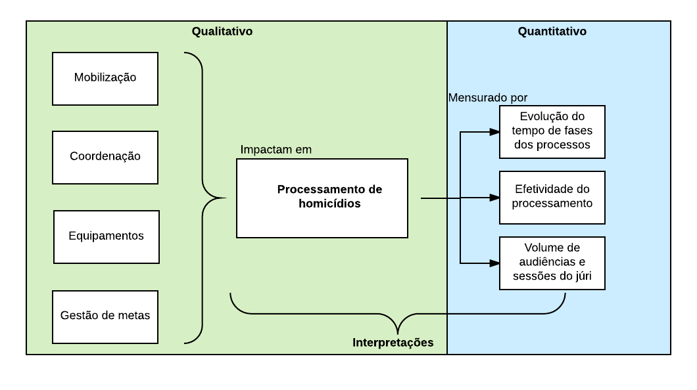

## O Processamento de Homicídios no Brasil e a Estratégia Nacional de Justiça e Segurança Pública em três estados: Alagoas, Santa Catarina e São Paulo 


A pesquisa considera um desenho misto, combinando métodos qualitativos e quantitativos para fornecer uma avaliação sobre a execução da ENASP e medir seu efeito no processamento de homicídios no Brasil. A avaliação é feita por meio de análise documental, entrevista de gestores, análise de uma amostra de processos e estudo da evolução dos tempos de duração e efetividade do processamento de homicídios em várias fases, nos estados de Alagoas, Santa Catarina e São Paulo. 

O presente estudo tem como objetivos específicos:

i) Identificar e descrever as atividades da ENASP para auxiliar os estados no processamento de homicídios por meio de documentação e entrevistas.
i) Identificar e descrever a influência da ENASP no processamento de homicídios por meio dos seguintes fatores:
    a. Aferir a percepção de impacto dos gestores federais e de três estados   pré-selecionados;
    a. Estimar a duração e evolução dos intervalos de tempo das fases de processamento de homicídios, estimar a evolução da eficácia dos processos, e da quantidade de audiências e sessões de júri relacionando todas estas medidas com a execução da ENASP;
    a. Comparar os relatos dos gestores e as análises quantitativas com a prática verificada em uma amostra de processos;


Em seguida, a seção de resultados começa apresentando como foi a evolução da ENASP no âmbito federal e depois abre uma seção de estudos de caso. Os três estados estudados em detalhes foram previamente selecionados por representarem regiões e contextos diversos de modo a permitir uma visão mais representativa da execução e efeitos da ENASP. Todos os estados têm os seguintes conteúdos em comum: i) análise de entrevistas realizadas com gestores da ENASP em cada estado ii) análise da documentação sobre o cumprimento das metas da ENASP e iii) análise quantitativa de alguns dos padrões de tramitação dos processos de homicídio distribuídos entre 2009 e 2015. Em Alagoas há um conteúdo adicional de análise do funcionamento da Câmara Técnica de Monitoramento, já o estado de São Paulo conta com uma análise adicional de uma amostra de processos de homicídio da capital. 

A pesquisa termina avaliando a ENASP de forma unificada como estratégia federal de melhoria do processamento de homicídios. A conclusão também traz algumas recomendações para seu aperfeiçoamento, considerando a documentação, as percepções dos gestores, a coleta de dados quantitativos, a análise de amostras e a viabilidade prática.

-------------------------------------------------------------------------------

O Brasil é o país recorde de homicídios no mundo. Somamos quase 60 mil homicídios dolosos em 2014, em uma taxa de 29,1 homicídios a cada 100 mil habitantes, enquanto a média mundial é de 6,2 (ONU, 2015). Sob esta taxa nacional há importantes diferenças entre estados como São Paulo e Pernambuco, que apresentaram quedas entre 52% e 27% nos últimos anos, e  estados como Ceará e Maranhão, que apresentaram crescimento entre 166% e 209%, respectivamente. Existem variações também entre grupos demográficos. Homens são 8,6 vezes mais vitimados, jovens entre 15 e 29 anos têm o dobro de probabilidade de serem assassinados, negros e pardos têm índice de homicídios 30% maior do que o da população geral (IPEA; FBSP, 2016). 

Estatísticas de homicídios são necessárias para compreendermos a dimensão do problema no país e direcionar o planejamento de políticas de prevenção concretas e eficientes. O mesmo conhecimento é necessário a respeito da resposta dada pelo Estado a esta que é a mais grave violação de direitos. Conhecer o índice de resolução e de responsabilização é um dado básico para identificar boas práticas e locais que precisam de atenção diferenciada, mas este dado atualmente não é produzido por nenhum órgão brasileiro1. O índice mais utilizado se refere ao porcentual de inquéritos denunciados, indicando cerca de 8% (ENASP, 2012). Há outras estimativas estaduais obtidas em momentos e com metodologias diferentes que dificultam comparações, sendo importante destacar que nenhuma delas alcança 50%. 

---
A falta de resposta estatal gera indignação uma sensação de impunidade que é também
contraditória em um país com a quarta maior população carcerária do mundo, mas em que
apenas 14% do total estão presos por homicídio (DEPEN, 2014). A falta de confiança nas
instituições (FGV, 2015) pode levar a população a recorrer a medidas incompatíveis com o
Estado de Direito, como o apoio à execução de supostos criminosos (DATAFOLHA; FBSP,
2015). 

---

Em relação à fase policial, a maior falha identificada encontra-se nas provas técnicas e na excessiva dependência de provas testemunhais. Existem deficiências na formação de policiais que não preservam a cena de maneira apropriada e relatos generalizados de falta de recursos adequados. A fragilidade dos institutos de criminalística e sua pouca integração com os demais operadores são barreiras decisivas na evolução do processamento no Brasil. A média nacional de denúncias foi estimada em 8% em 2010 (ENASP, 2012) e o fato da ENASP, com esforços extraordinários, ter alcançado 19% demonstram que há enorme desafio qualitativo nessa fase.

Parte dessas fragilidades estruturais de falta de efetivo e equipamentos poderia ser mitigada se houvesse otimização do trabalho dos policiais por meio de políticas específicas de qualificação, acesso a mais ferramentas tecnológicas e bases de dados estaduais e federais interoperáveis. Uma medida paliativa disponível é a requisição estadual de membros da Força Nacional de Polícia Judiciária e Técnico-Científica que reúne profissionais de todo o país deslocados para auxiliar equipes locais por tempo pré-determinado. No entanto, o simples aumento da quantidade de policiais não é suficiente para obter melhora correspondente nos indicadores de produtividade (ADORNO; PASINATO, 2010) sendo preciso acompanhamento de capacitação e gestão adequadas.

A melhora da eficácia após a criação de delegacias especializadas é consenso na literatura, havendo casos representativos no país. Elas permitem maior especialização pela prática acumulada e por treinamentos direcionados, e apresentam desenhos organizacionais diferentes, podendo desenvolver fluxos mais eficazes para o padrão da sua região, considerando que também impactam na investigação o perfil da ocorrência e vieses demográficos (FIGUEIREDO; MINGARDI, 2005). Diante da escassez de recursos, a boa gestão do fluxo de trabalho, de pessoal e recursos de cada unidade se torna decisiva.

Entre as dificuldades identificadas na atuação do Ministério Público (ENASP, 2012) está a frequência com que promotores solicitam diligências inespecíficas, contribuindo pouco para o melhoramento dos inquéritos, assim como o incompleto exercício de controle da atividade policial no que se refere tanto a possíveis irregularidades no decorrer do processamento quanto aos excessos de prazo. A posição do Ministério Público é exemplar do delicado equilíbrio entre as instituições envolvidas. É importante que promotores mantenham distância sadia tanto em relação ao Judiciário, para assegurar imparcialidade diante da denúncia, quanto perante as polícias, cuja atividade devem fiscalizar. Simultaneamente, devem se manter a par da realidade da atividade policial para fiscalizá-la e colaborar construtivamente. O mesmo se refere ao Judiciário, preocupando-se com a sustentação de sua denúncia. 

Na fase judicial, a maior dificuldade identificada é a morosidade. Uma referência neste tema é a pesquisa realizada pelo CRISP em 2014 (RIBEIRO et al., 2014) que analisou retrospectivamente a duração de fases do processamento de homicídios que chegaram à sentença do júri em 5 capitais brasileiras: Belém, Belo Horizonte, Goiânia, Porto Alegre e Recife. Nesses casos, foram identificadas medianas entre 60 e 231 dias para a fase de inquérito cujo prazo processual é entre 10 e 30 dias. Na fase de denúncia, cujo prazo previsto é de 15 dias, as medianas ficaram entre 14 e 56 dias. O prazo entre aceite da denúncia e a realização da AIJ é de 60 dias, mas a mesma pesquisa identificou medianas entre 147 e 456 dias. Em relação ao período entre pronúncia e decisão do júri, as medianas ficaram entre 386 e 1.209 dias (3,3 anos) resultando em médias de tempo total (da descoberta do crime à sentença do júri) entre 2.058 a 3.403 dias (entre 5,6 e 9,3 anos) evidenciando a concentração da morosidade na fase judicial.

Em relação ao conteúdo da fase judicial, é preciso mencionar que o acesso à defesa não é simples dada a escassez de defensores públicos (IPEA; ANADEP, 2013), fator que gera seletividade e disparidade na qualidade da defesa baseada em um perfil econômico, algo incompatível com nosso Estado de Direito. Análises textuais também identificam que há casos em que juiz ou promotor recuperam depoimentos ou confissões do inquérito, rompendo o princípio de separação entre as fases inquisitorial e processual. Há casos de depreciação da atividade da Defesa (SILVA, 2014) e de juízes que solicitam diligências adicionais (MACHADO, 2016), ou que demonstram desejo de atender aos apelos sociais de maior rigor penal (ARP; SOU DA PAZ, 2014) violando o princípio da isonomia entre as partes.


```{r}

```


```{r}

```


---

## Metodologia

A metodologia utilizada mesclou dois métodos qualitativos e dois quantitativos que se complementam: i.1) entrevistas com gestores e operadores da ENASP, i.2) análise dos relatórios e documentos produzidos pela equipe da ENASP, ii.1) análise de uma amostra de processos de homicídios da comarca de São Paulo e ii.2) análise de dados gerais de amostras ou da totalidade de processos de homicídio que tramitaram nos estados de Alagoas, Santa Catarina e São Paulo entre 2009 e 2015. 

O método adotado apresenta suas principais dificuldades no momento de agregar os resultados para obtenção das interpretações. Neste caso, a parte qualitativa traz como resultado inicial um catálogo dos possíveis efeitos da ENASP como um todo organizado em quatro categorias: i) mobilização; ii) coordenação; iii) material e iv) gestão de metas. Já a parte quantitativa tem foco na mensuração de três elementos: i) tempos de algumas fases do processo de homicídio; ii) eficácia dos processos (percentuais de denúncias e pronúncias) e iii) quantidades de audiências e sessões do júri. Os resultados são mesclados com a utilização dos inputs qualitativos para validar ou invalidar as possíveis interpretações dos achados quantitativos. A Figura 3 esquematiza a ideia utilizada para união e comparação das duas formas de análise. 


```{r metodologia fig.cap='Esquema da utilização das metodologias qualitativa e quantitativa.'}

```


## Historia

-> homicidio
    -> gargalos do processamento
    -> ENASP
-> Resultados ENASP
    -> Quali
    -> Quanti
    -> Amostra
-> Recomendações

## Resultados


<!-- contextualizar -->
Com base nas análises quantitativas e qualitativas desta pesquisa, concluímos que se a Estratégia fosse julgada apenas pelo cumprimento de metas sua avaliação seria negativa. Várias metas não possuem relatórios ou documentação, os porcentuais de cumprimento são baixos e se referem a metas brandas, definidas para abarcar a diversidade de situações existentes nos entes da federação. 

O porcentual de cumprimento da Meta 2 alusivo aos inquéritos de 2007 alcançou 76% em 2016, se referindo a inquéritos abertos já há dez anos. Em 2012 (prazo inicial) estava em apenas 32%. Foi destaque nesta meta o fato do porcentual de denúncias do estoque ser de 19%, superior à média nacional de 8%, sendo que se referia a inquéritos antigos, mas ensejaria análise mais detida e qualitativa para ser interpretado se indica melhora na qualidade desses inquéritos ou benefício imediato dos mutirões e forças-tarefa, por definição, transitórios. É preciso mencionar também que essa média nacional de 8% foi obtida com dados precários e deve ser considerada apenas como referência. 

Não existem relatórios das Metas 1 e 5 e o da meta de 2015 ainda não fora publicado em setembro de 2016, constando no processômetro um cumprimento de 20%. A Meta 31 teve porcentual de cumprimento de 52% e a Meta 42, de 57%; para ambas não há relatórios analíticos disponíveis. 

<!-- resultado ENASP -->
No entanto, a ENASP foi além de suas metas e gerou valor para a sociedade desde sua formulação. O fato de três atores estatais de nível federal (CNJ, CNMP e MJ) terem se unido para o enfrentamento do crime de homicídio reforçou a mensagem de que este é um problema nacional, de responsabilidade compartilhada. Ao levantar dados nacionais, realizar diagnósticos sobre as principais dificuldades e definir metas comuns com os estados, provocou articulação entre as instituições envolvidas, definiu uma diretriz comum a ser perseguida e induziu a gestão por resultados, elementos fundamentais e ainda escassos no campo da segurança e da justiça criminal. Importa destacar também que ao criar ferramentas públicas de acompanhamento de resultados, a ENASP ajudou a fortalecer a prestação de contas do trabalho das polícias e dos atores do sistema de justiça à população, tendo importante efeito pedagógico para as instituições envolvidas e a sociedade.

Os estudos de caso demonstraram haver diferença no impacto da ENASP sobre a eficiência do processamento de homicídios, de acordo com variações de contexto estadual e intensidade com que as metas e demais atividades da ENASP foram implementadas. Em Santa Catarina e São Paulo, a ENASP apresentou efeito reduzido, podendo ter impactado principalmente nas fases após a primeira audiência. Já em Alagoas, impactos relevantes foram identificados tanto na fase entre a distribuição e o oferecimento da denúncia, quanto na capacidade de conversão de inquéritos em denúncias.

<!-- tempos -->
Em relação à análise de tempos, foi possível identificar redução sistemática nos tempos medianos ao longo dos anos. Em Alagoas, o efeito é mais perceptível na fase de investigação e provavelmente se trata de uma consequência direta da ENASP. Nos outros estados também observamos aceleração dos processos, mas não é clara uma atribuição direta à Estratégia. Uma exceção pode ser a fase entre pronúncia e júri, cuja aceleração pode apontar para um resultado da implementação anual das Semanas do Júri, além de iniciativas estaduais, como criação de uma vara especializada em SC. Em nenhum dos locais foi identificado efeito negativo da ENASP. 

<!-- atividades -->
As capacitações e o desenvolvimento de POPs foram bem avaliados pelos gestores e operadores, indicando que há demanda por políticas indutoras nos estados, mesmo que essas atividades sejam realizadas de forma inconstante. Diante dessa demanda dos estados por mais capacitações e orientações, sugestões viáveis incluem potencializar os momentos de relatoria e prestação de contas para ativar um canal de orientações do grupo gestor federal, assim como intercalar capacitações e reuniões presenciais e à distância.

<!-- negativos -->
Com relação aos pontos negativos, o principal foi a dispersão dos trabalhos. A partir de 2014, as reuniões se tornaram mais escassas e a documentação foi insuficiente. A queda do fôlego também pôde ser percebida na análise de volume de audiências, que apresentou esforço inicial brando, mas foi abandonado em menos de um ano. Em uma das entrevistas foi explicitado: “não é institucionalizada a ENASP, é Estratégia [...] depende das pessoas que estão a frente, esse é o grande problema”, reflexão que instiga a considerar, inclusive, se outros instrumentos de formalização poderiam alavancar esta institucionalização. 

Ficou claro nas entrevistas que o grau de engajamento e liderança exercido por cada uma das instituições, no nível federal e estadual, tem impacto direto na implementação da ENASP. Ter uma equipe gestora federal que divulga periodicamente o andamento, cobra resultados e direciona demandas de forma rápida também se mostrou determinante. Observou-se diferença no engajamento das instituições federais ao longo do tempo, com destaque ao MJ no início e ao CNMP nos últimos anos. Apesar de não ser necessariamente desvantagem, no caso da ENASP ocasionou certa passividade dos demais envolvidos. Para recuperar o engajamento federal integral (e obter seu reflexo nos estados), seria importante retomar as reuniões e prestações de contas com periodicidade fixa e reduzir a rotatividade dos líderes nacionais e estaduais.

Também teve impacto no grau de engajamento das instituições a existência de metas específicas que envolvessem cada uma delas. No momento atual, por exemplo, a Polícia Civil se encontra um pouco afastada dado ao fato de sua meta ter apenas informalmente evoluído automaticamente estando desde 2012 sem progredir para especificidades (como a do Judiciário evoluiu para processos suspensos) e sem gerar nenhuma forma de prestação de contas ou de envolvimento formal. Este é um fato que precisaria ser sanado dado que esta pesquisa, tanto nas entrevistas quando na análise da amostra de São Paulo, corroborou que a fase policial é o principal gargalo quantitativo para o processamento de homicídios e concentra diversos pontos que poderiam ser trabalhados pela ENASP.

Apesar de ter um núcleo comum em torno dos homicídios, a ENASP desenvolveu muitos eixos temáticos relacionados que demandaram energia sem apresentar resultados, como as Metas 1 e 5 e a lista de alterações processuais que teriam sido abandonadas. Entre as atividades paralelas às metas que se desenvolveram, além da promoção de formações e criação de POPs já mencionados, merece destaque a promoção das Semanas do Júri que, apesar de paliativas, consistem em momento de articulação entre as instituições judiciais que pode ser potencializado.

Um destaque negativo que contrasta com a indução de uma política pública pautada pela gestão de resultados foi a falta de documentação, sistematização e avaliação da ENASP em nível nacional, impedindo uma avaliação mais ampla da iniciativa. É recomendado que a ENASP aprimore não apenas sua documentação interna e a alimentação dos inqueritômetro e processômetro, mas também a publicidade dos resultados para a sociedade de forma ativa e mais acessível, sendo exemplo prático da compreensão de que o fluxo do processamento começa na comunicação da ocorrência pela população e termina apenas com a resposta estatal dada a esta mesma população. Recuperando seu propósito inicial de reduzir a impunidade dos homicídios no Brasil, seria fundamental criar e alimentar uma ferramenta que meça e publique periodicamente a evolução deste indicador. 


<!-- cardapio -->
Com base nas conclusões levantadas e na importância social do adequado processamento dos homicídios, listamos onze sugestões para aprimoramento da ENASP ou de novas atividades que auxiliem a evolução do processamento de homicídios no Brasil:


-------------------------------------------------------------------------------

5.1	Atividades da ENASP e gestão federal

A ENASP gerou ganhos para o processamento de homicídios desde sua formulação. A iniciativa colaborou com a realização de um diagnóstico da situação do processamento de homicídios no Brasil, passo inicial para implantação de qualquer política pública. Evidenciou-se dificuldade em se obter dados confiáveis, havendo casos de estados nos quais o levantamento do estoque teve de ser feito manualmente. Houve também um grande estoque de mais de 138 mil inquéritos inconclusos há mais de 5 anos, superando as expectativas e evidenciando a necessidade de políticas especiais para melhor eficácia e eficiência do sistema de justiça criminal e segurança pública como um todo, dando aos gestores e à sociedade a real dimensão da quantidade de homicídios não julgados e da extrapolação dos prazos processuais.

Em relação ao atingimento das metas, a avaliação mais completa existente é a que trata da Meta 2. Além de trazer estatísticas de andamento, também apontou para as principais dificuldades encontradas na sua execução, permitindo aprofundamento do diagnóstico anteriormente existente.

O porcentual de cumprimento da meta referente aos inquéritos de 2007 alcançou 76% no ano de 2016 (referindo-se a inquéritos abertos já há 10 anos). É necessário considerar que em 2012 (prazo inicial) estava em apenas 32%. Foi destaque nessa meta o fato de que o porcentual de denúncias do estoque inicial foi de 19%, considerado superior à média nacional de 8%, incremento que chama atenção por se referir a inquéritos antigos, com maior dificuldade de produzir novas provas, mas que ensejaria análise mais detida e qualitativa para ser interpretado se indica melhora na qualidade desses inquéritos ou maior quantidade de denúncias feitas sobre inquéritos que apenas se beneficiaram de mutirões e forças-tarefa realizadas durante a execução da ENASP. Também é preciso mencionar que esta média nacional de 8% foi obtida por meio de dados precários e deve ser considerada referência e não aferição precisa.

A Meta 3 teve porcentual de cumprimento de 52% e a Meta 4, de 57%. Para ambas não há relatórios analíticos disponíveis. Como mencionado, ainda não foi feito relatório da meta de 2015 e, até o momento, o processômetro indica porcentual de cumprimento de 20%.

A ENASP também incorporou algumas iniciativas específicas vistas como estratégicas para cumprimento das metas, como: realização de cursos e workshops, elaboração de Procedimentos Operacionais Padrão (POPs), criação de CTMPPs, emprego da Força Nacional de Polícia Judiciária, Semanas do Júri e a Campanha "Conte Até 10".

Sobre os cursos e workshops, o relatório de 2012 menciona que eles foram promovidos em 15 estados, mas não foi possível identificar uma lista das capacitações desenvolvidas pela ENASP, as instituições contempladas e as datas de início e término dessas formações. Em relação à criação de POPs, também não há uma lista formal de quais foram elaborados como parte da ENASP ou de outras iniciativas. O MJ criou em 2014 um guia didático para investigação de homicídios e um currículo mínimo comum para operadores da área de segurança. Entre os gestores estaduais entrevistados, no entanto, nenhum conhecia esses produtos, o que pode indicar que estes tenham sido pouco disseminados.

Ainda em 2010 a ENASP listou alterações processuais que deveriam ser fomentadas nos estados ou, quando pertinente, objeto de propostas de alteração legislativa. No entanto, não houve acompanhamento ou sistematização a respeito de em quais estados esses procedimentos foram adotados ou qual o destino das intenções de propor alterações legislativas.

As Semanas do Júri são realizadas desde 2014 e costumam ter ampla divulgação de seus resultados. Em 2014 foram 2.442 audiências, em 2015, 2.616 e em 2016 espera-se alcançar número maior por terem estendido a iniciativa para todo um mês. Os entrevistados avaliaram que esta iniciativa é boa por aliviar a pauta de audiências e ser precedida de reuniões de alinhamento entre juízes, promotores e defensores, mas destacaram que se trata de iniciativa paliativa e que nas comarcas sem varas exclusivas de júri a extensão da iniciativa para todo um mês provavelmente se mostrará inviável.

A Campanha "Conte Até 10" foi a única iniciativa diretamente voltada à prevenção. Tinha como objetivo prevenir os crimes por motivos banais ou fúteis pela elaboração de cartilhas, vídeos, capacitações e palestras veiculadas por diversos meios de comunicação e especialmente disseminadas em escolas. No entanto, não foi feito nenhum acompanhamento de resultados, sendo considerada por alguns entrevistados como pouco conectada com o restante da Estratégia, por exemplo na fala: “Poderia ter tido uma articulação maior com a Segurança Pública [...] uma coisa meio sem ter sido muito articulada, eu acho que ela poderia ter produzido maior efeito”.

A Força Nacional de Polícia Judiciária foi empregada na execução da ENASP e, entre os casos aqui estudados, apenas Alagoas a recebeu. Apesar de ser auxílio evidente em efetivo, não ouve consenso entre os gestores sobre a Força proporcionar ou não ganhos permanentes. No geral, gestores federais identificaram ganhos perenes por meio da troca de experiências entre profissionais de diversos estados e com formação adicional, no entanto, gestores estaduais em sua maioria mencionaram que na prática há poucas oportunidades para troca de experiências com as equipes, no geral se mantendo apartadas.

As CTMPPs consistiam na realização de reuniões mensais entre delegados de polícia e membros do Ministério Público que, sob coordenação de um membro do Tribunal de Justiça, analisariam inquéritos e processos judiciais do mês anterior para elaboração de estratégias de efetividade e celeridade. Além disso, as Câmaras seriam espaços para debate da gestão do processamento como um todo e de novas políticas de prevenção, sendo incentivada participação eventual de outros órgãos, como Defensorias Públicas, Polícia Técnico-Científica e Ordem dos Advogados do Brasil.

A implementação da CTMPP se deu pelo fomento apenas em estados do Nordeste, escolhidos como prioritários por seus altos índices de homicídios. A proposta é que ela fosse apenas uma primeira etapa de implementação, para depois ser disseminada nacionalmente, no entanto, no formato e sob fomento da ENASP, prosperou apenas em Alagoas. Atualmente há Câmaras semelhantes sendo desenvolvidas por meio de outras iniciativas, em outros locais, como DF e Ceará. Nas entrevistas foram coletadas propostas de melhorias para a ENASP. Aquelas que se mostram pertinentes quando relacionadas aos resultados qualitativos e quantitativos estão elencadas na Conclusão.

5.2	Estudos de caso

A pesquisa sobre a ENASP em seu âmbito federal identificou que a Estratégia teve sua implementação realizada de forma diversa entre as unidades da federação. Somado a isto o fato de que os estados também apresentam contextos diversos em seus sistemas de segurança e justiça, a pesquisa aprofundou a análise sobre a ENASP em três estados de contextos diversos, com vistas a identificar como a Estratégia impactou o processamento de homicídios em sua execução prática e também se resultou em ganhos permanentes para os estados.

5.2.1	Alagoas: ENASP e CTMPP

Em 2010 Alagoas se destacava pelos maiores índices de homicídio do país, 68 por 100 mil habitantes, enquanto a média nacional era de 231. No mesmo ano foi identificado um estoque de 4.180 processos de homicídios inconclusos desde 2007, taxa de 134 inquéritos por 100 mil habitantes, sendo que a taxa nacional era de 71 por 100 mil habitantes (ENASP, 2012). Apesar de o estado ter taxa mediana de integrantes da Polícia Civil por habitante, apresentava a menor taxa de delegados por habitante. Pela gravidade de sua situação, Alagoas foi escolhida para implementação de alguns programas federais, entre eles o Brasil mais Seguro, o fomento da primeira CTMPP e o deslocamento da Força Nacional de Segurança. O Programa Brasil Mais Seguro, lançado em junho de 2012, tinha entre seus objetivos alguns que se sobrepunham à ENASP, como “fortalecer a investigação e perícias policiais, o policiamento de proximidade” e “promover a integração entre as instituições de segurança pública e justiça”. Desta forma, houve em Alagoas dupla incidência e sobreposição entre políticas, não sendo completamente claro entre gestores locais e federais a qual iniciativa as ações derivavam, dificultando também o diagnóstico desta pesquisa sobre quais resultados podem ser imputados à ENASP, à CTMPP ou ao Brasil Mais Seguro. 

Exemplo dessa sobreposição é a própria CTMPP, identificada por gestores federais com a ENASP, foi implementada em Alagoas primeiramente como local de monitoramento das ações do Brasil Mais Seguro, sendo também este o Programa responsável pelo manual de implementação da Câmara. A vinculação desta Câmara com a ENASP não é clara formalmente e tampouco entre seus membros e gestores da ENASP no estado.

Em 2010 foi estruturado em Alagoas um grupo gestor estadual da ENASP composto por membros do Ministério Público, Tribunal de Justiça e Polícia Civil. A articulação com o grupo gestor federal foi a mais próxima entre os estados analisados, havendo contato constante e reuniões com gestores federais também em Alagoas, no entanto, foi relatado que as reuniões e seu contato com o âmbito federal teriam se tornado escassos a partir de 2014.

Já a CTMPP, teria sido criada entre final de 2012 e início de 2013 para monitorar o Brasil Mais Seguro, mas suas reuniões não tiveram qualquer sistematização pública do conteúdo debatido, das decisões tomadas ou mesmo relatórios mensais sugeridos pelo manual nacional, de modo que tivemos que nos ater aos relatos de seus participantes. Foi descrito que a CTMPP sempre esteve sob coordenação do Tribunal de Justiça, realizando reuniões quinzenais. Além do Tribunal, Ministério Público e Polícia Civil também há representantes fixos da Polícia Militar, Defensoria Pública, Secretaria de Segurança Pública do Estado e, mais recentemente, a Secretaria de Segurança do Município de Maceió e a Estadual de Prevenção, além de outros convidados pontuais. 

Os participantes da CTMPP não são os gestores da ENASP que, por sua vez, sabem pouco sobre as atividades da CTMPP, reforçando a desvinculação dessas iniciativas. Há preocupação institucional em evitar rotatividade dos membros da Câmara, dando-lhe continuidade, assim como atenção para o envio de representantes com poder de decisão, para que a Câmara seja um grupo efetivo. Apesar de ter sido relatado como desafio constante, os participantes da Câmara relatam que a manutenção dessa audiência ampla, interinstitucional e qualificada contribui para continuidade e legitimidade da Câmara, que é reconhecida pelo governo do estado (tendo passado por mais de uma administração) e pelas instituições participantes como uma instância com peso decisório. Uma das entrevistas ilustrou: “[...] acho que o maior capital político da Câmara é essa integração com as instituições. Isso é algo já consolidado [...] a gente tem muita credibilidade junto às instituições [...] essa Câmara tem um viés técnico, mas também tem um viés político no sentido de articulação”. 

Em relação ao conteúdo tratado, a pauta da CTMPP é construída coletivamente a partir da sugestão dos membros e da coordenação do Tribunal de Justiça. Teriam começado tratando prioritariamente da evolução dos indicadores de homicídios (e não dos casos concretos, como seria a proposta da Câmara da ENASP), mas nos últimos anos a pauta passou a incluir outros temas, inclusive fora do campo dos crimes violentos letais intencionais, como expresso em uma das entrevistas: “Hoje está pulverizado, já estamos até caminhando para prevenção, entendeu? Mas o foco principal durante muito tempo foi os homicídios”. Os motivos mencionados para essa mudança foram i) esgotamento da pauta após certa quantidade de reuniões, ii) queda nos índices de homicídios e iii) sobreposição do tema de acompanhamento dos indicadores de homicídios, que também seria tratado em outras instâncias.

Além do funcionamento da Câmara Técnica e do grupo gestor estadual, a gestão da ENASP dentro do Judiciário é feita de forma descentralizada, solicitando prioridade aos casos que compõem as metas e mobilização nas Semanas do Júri. Já a gestão na Polícia Civil e no Ministério Público foram mais coordenadas. Entre as medidas tomadas, esteve o direcionamento para que a Central de Inquéritos Pendentes (CIP), delegacia já existente, concentrasse todos inquéritos do estoque identificado pela ENASP da capital. A CIP recebeu efetivo adicional de agentes e delegados, e também as primeiras forças-tarefas conjuntas com profissionais da Polícia Judiciária e do MP formalizadas em novembro de 2011. 

Em 2012 a DHPP de Maceió foi reestruturada e atualmente tem quatro equipes alocadas com delegados especializados, escalas de plantão e membros da Força Nacional que respondem à coordenação geral de uma delegada especializada. Ainda na atuação da ENASP sobre a fase policial, Alagoas foi o único estado em que foi reportado recebimento de instrumentos específicos: ao menos 10 maletas com equipamentos de perícia para local de crime distribuídas em novembro de 2011, mas gestores atuais não identificaram se ainda estão sendo utilizadas. 

Em decisão recente do Conselho de Segurança Estadual, composto pela Secretaria de Segurança Pública, Ministério Público e OAB, foi determinada uma meta de que cada delegacia do estado relate ao menos 12 inquéritos por mês, meta esta que gestores locais ponderaram ser simplória, sem consideração às especificidades de delegacias e que redirecionou parte dos esforços de investigação.

Evidenciando reformulação maior da gestão da segurança no estado, recentemente foi instalada a prática de reuniões diárias de situação na Secretaria de Segurança, contando com secretário, polícia militar, polícia civil e polícia técnico-científica para acompanhar indicadores e reconhecer situações emergenciais que prescindam de cooperação. Também foi instituída reunião semanal entre equipes de inteligência das polícias, Secretaria de Segurança, Ministério Público e Polícia Federal. Essa coincidência de esforços dificulta a atribuição de resultados à ENASP, mas é notório o foco comum entre todos de maior cooperação interinstitucional.

Em relação aos resultados, Alagoas apresentou 16% de cumprimento da Meta 2 em 2012 e atualmente registra 59%. As Metas 3 e 4 apresentaram 55% e 48% de cumprimento e a meta de 2015 foi reportada no relatório anual do TJAL com 7% de cumprimento. Considerando que Alagoas foi um dos estados que mais recebeu recursos (Força Nacional e equipamentos) e que teve acompanhamento mais próximo da gestão federal, os resultados podem ser considerados menores do que o esperado.

As maiores dificuldades relatadas no estado estão relacionadas à falta de profissionais em todas as instituições. Esta carência impacta toda cadeia, desde a falta de perícias e atrasos nos laudos e diligências, até o acúmulo de atuação em mais de uma vara por promotores e juízes. Também foi relatada falta de recursos e equipamentos, como local físico para o Instituto Médico Legal, lanternas e reagentes para perícias, viaturas e salas de audiências. Além disso, mesmo após estruturação da DHPP, nem todos envolvidos na persecução de homicídios são especializados. Apesar das taxas de homicídio terem caído cerca de 10% desde o início da ENASP, esta queda não parece ter tido impacto relevante no alívio da sobrecarga sobre os servidores. 

O fato de a Força Nacional de Polícia Judiciária estar presente no estado há mais de cinco anos reforça a reclamação dos atores locais sobre a falta de pessoal. Também é contestável essa longa permanência, visto que deveria se tratar de uma política transitória, sendo importante que haja planejamento para a retirada da Força e, se confirmada necessidade contínua de efetivo adicional, tenha devida transição para novas equipes permanentes estaduais.

Em relação aos sistemas de dados, operadores relatam que desde 2010 houve melhorias sensíveis. Devido às fragilidades anteriores, havia constantes atrasos na alimentação dos dados do inqueritômetro, os quais acabavam sendo inseridos já defasados. Neste momento, os sistemas da Polícia Militar e Polícia Técnico científica já estariam interligados e o sistema da Polícia Civil estaria em migração para permitir a interligação de todas as polícias prevista em 2017. Ainda assim, há demanda pela ampliação do escopo dos bancos de dados, especialmente para permitir a identificação e localização de pessoas.

Houve avanço também nos sistemas utilizados pelo Tribunal de Justiça, cujos dados são coletados e processados pela Assessoria de Planejamento e Modernização (AMPM), que reúne informações relativas à todas as metas incidentes no Tribunal individualizadas por vara. Destaque também é merecido ao fato de que o Tribunal de Alagoas determinou como prioridade a digitalização integral dos processos em andamento, projeto cuja previsão de conclusão é 2017. 

5.2.2	Santa Catarina e a ENASP

O estado de Santa Catarina apresenta contexto muito diferente, com índice de homicídios entre os mais baixos do país: 12 por 100 mil habitantes. Em 2010 seu estoque de inquéritos incluídos na meta ENASP era de apenas 235 casos, taxa de 3,76 por 100 mil habitantes, a segunda menor do país. Tinha quantidade mediana de membros da Polícia Civil e uma taxa de peritos superior à média nacional. O estado também já possuía DHPP, ainda que com dificuldades estruturais, como a falta de computadores individuais para investigação. Santa Catarina era classificada, no entanto, como tendo baixo grau de qualidade e confiabilidade nos dados de segurança apresentados2, diferentemente de Alagoas e São Paulo. 

As instituições locais consideraram a ENASP positiva para retomar atenção sobre os inquéritos e processos antigos e destacar o impacto social do homicídio, mas houve ponderações sobre falta de investimentos federais na forma de capacitação e efetivo, assim como sobre o menor efeito no estado dado o tamanho do estoque. Coadunando com esse efeito mais disperso, não foi considerada necessária organização de mutirões ou forças-tarefas. A gestão estatal foi feita de forma descentralizada nos Ministério Público e Judiciário, que ficaram responsáveis por dirimir possíveis necessidades de articulação interinstitucional e recomendaram que cada vara elaborasse um plano de trabalho e sinalizasse, caso precisasse receber auxílio. 

O Tribunal de Justiça possui procedimento interno com todo histórico da ENASP e é responsável pela mobilização ao redor das Semanas do Júri. Uma medida de importante impacto no processamento foi a criação em 2012 de uma vara exclusiva do júri na capital, mas, no entanto, os gestores não confirmaram se essa mudança teve relação com a ENASP. 

Em relação à Polícia Civil, a gestão teria sido mais centralizada e se desenvolvido de forma bastante próxima até 2014. Com a ausência de metas específicas para Polícia Civil, a instituição ficou um período sem gestores da ENASP, tendo voltado a serem nomeados em 2016. A Defensoria ainda não está integrada ao funcionamento da ENASP e suas participações se restringiram a algumas reuniões do grupo gestor federal e às Semanas do Júri. Em que pese a instituição ser recente, constituída em 2013, seria importante já ter sido ativamente envolvida na ENASP, tanto por ser ator fundamental quanto por acrescentar olhar diferenciado. 

Foi relatado que até 2014 as reuniões do grupo gestor estadual ocorriam sob demanda, mas no momento da realização desta pesquisa já não aconteciam e teriam sido substituídas por reuniões bilaterais pontuais. A relação com o grupo gestor federal teria sido pouco próximo, respondendo às convocações e, em 2016, havendo apenas uma reunião por videoconferência. 

Confirmando que o estado tinha problemas de consistência nos dados oficiais, os gestores relataram que o primeiro levantamento de estoques foi feito de forma manual. Desde então, os sistemas de dados vêm melhorando sem haver, no entanto, integração entre dados das diferentes instituições. Destacam-se nesta questão o Tribunal de Justiça, que estaria investindo na digitalização dos processos, e a precariedade com que trabalha a Defensoria há mais de três anos, sem contar com um sistema de dados. 

Nenhum dos gestores estaduais tinha conhecimento da existência das CTMPPs. Cabe mencionar, no entanto, que ao longo de 2016 o Ministério Público Estadual vem desenvolvendo um grupo de trabalho composto por promotores e delegados para se debruçarem sobre inquéritos de homicídio doloso, sendo notória a semelhança da proposta com as CTMPPs e evidenciando que, mesmo em estados com perfis diferentes, a proposta das Câmaras de Monitoramento pode ser pertinente e teria condições de ter se desenvolvido antes ou mais facilmente se houvesse tido contato com o modelo desenhado e promovido pelo âmbito federal. 

Quanto aos resultados, em 2012 Santa Catarina concluiu 54% dos inquéritos do estoque da ENASP. Atualmente o estado registra 94% de cumprimento dessa meta. Em relação à Meta 3, foi registrado apenas 35% de cumprimento e não foram fornecidos dados relativos à Meta 4, corroborando a fragilidade dos seus sistemas de informação. Através dos nossos levantamentos, obtivemos evidências de que o cumprimento da Meta 4 ainda está em curso e que esforços em prol do cumprimento da Meta 3 não foram detectados em 2015.

O fato de Santa Catarina ter estoque pequeno, não ter criado forças-tarefa e não ter cumprido a maior parte da Meta 2 poderia ter soado um alerta de que era um estado com potencial para melhorar seu desempenho a partir de ações já conhecidas e relativamente simples. Cabe reforçar que o estado serviu de exemplo para comprovação de que existe demanda pelas CTMPPs e por diagnósticos mais profundos, pontos nos quais a ENASP poderia contribuir com fomento e compartilhamento de experiências prévias.

Em relação à fase judicial, destaque foi dado à criação da vara especializada de júri que teria evoluído rapidamente e acelerado a tramitação dos processos, se tornando referência para outros estados. Verificou-se, de fato, redução muito significativa no tempo de tramitação da fase judicial dos processos de homicídio. A implementação dos processos digitais também foi destaque no tema dos sistemas de informação do estado, trazendo diversos ganhos de agilidade por dispensar cargas e organizar o fluxo de trabalho. 

As Semanas do Júri mostraram ser importantes momentos de mobilização interinstitucional, no entanto, gestores ponderaram que elas também trazem efeitos deletérios em varas que acumulam diversos temas e no forte componente midiático de enfoque punitivista, não abarcando a qualidade dos processos. 

Foi destacada no estado a demanda por metas ou atividades mais voltadas à melhoria da qualidade, tanto dos inquéritos quanto dos processos. A maior dificuldade, no geral, foi localizada nos inquéritos por afetarem toda cadeia de processamento sendo, as mais relatadas: insuficiência de profissionais na Polícia Civil e Técnico-Científica, falta de acesso a bancos de dados com informações estratégicas e a equipamentos para provas periciais. 

De modo geral, a avaliação foi de que a ENASP teria contribuído para identificação de problemas como a falta dos sistemas de dados e de varas especializadas, cuja criação teria tido impacto permanente. No entanto, alguns gestores mencionaram que esperavam mais apoio do grupo gestor federal, tanto em recursos quanto em mobilização. 
5.2.3	São Paulo, a ENASP e análise de amostra de processos

O contexto de São Paulo incluía o menor passivo inicial de inquéritos quando analisado em taxa: 3,45 por 100 mil habitantes (ENASP, 2012). Apesar de ter quantidade mediana de integrantes da Polícia Civil, tinha grande porção de delegados perante a taxa média do Brasil. Em relação ao judiciário, contava com 1.800 processos incluídos na Meta 3 e 1.672 na Meta 4. À época da criação da ENASP, o estado já havia reduzido consideravelmente sua taxa de homicídios. O índice que fora de 33,3 em 2001 começava a flutuar ao redor dos 10 homicídios por 100 mil habitantes, segundo a Secretaria de Segurança Pública, queda que também pode ter contribuído para diminuição dos estoques.

Em relação à estrutura de processamento, São Paulo contava com uma DHPP desde 1986 que, tendo passado por reestruturações nos anos 2000, era referência no país. Também já havia diversas varas especializadas, cujas capacidades precisam ser relativizadas diante das dimensões populacionais do estado. Os operadores entrevistados afirmaram considerar a ENASP uma iniciativa necessária e pertinente pela percepção de que os índices de esclarecimento e julgamento de homicídios não eram insuficientes, mas houve críticas construtivas ao tipo de metas e ações propostas. 

A gestão estadual foi decentralizada no Ministério Público e na Polícia Civil, apenas solicitando prioridade aos casos selecionados e atendendo possíveis pedidos de assistência das unidades administrativas como, por exemplo, o envio de juízes auxiliares às varas com maior estoque. Não foi considerado necessário organizar mutirões ou grupos de trabalho especiais. No Tribunal de Justiça a gestão também se deu de forma descentralizada à exceção das Semanas do Júri em que, como nos demais estados, o Tribunal fazia a coordenação entre as demais instituições para formar a pauta de audiências. Em relação à Defensoria Pública, sempre teve gestores nomeados, mas não há relatos de participação ativa além das Semanas do Júri. O grupo gestor estadual teria se reunido com mais frequência até 2014, tendo desde então reduzido suas atividades apenas ao redor das Semanas do Júri. Esta redução coincide com o período de relativo afastamento da gestão federal e maior escassez das reuniões nacionais. 

O estoque relativamente pequeno, a existência do DHPP consolidado e a boa relação entre Polícia Civil e Ministério Público foram citados como fatores facilitadores ao desenvolvimento da Meta 2. Nenhuma das instituições reconheceu a criação de fluxos ou novos procedimentos. A principal alteração na rotina se deu pela priorização e realocação pontual de profissionais. 

São Paulo recebeu workshops promovidos pela ENASP. Membros do Ministério Público local participaram da sua montagem e seu conteúdo foi bem avaliado. Ainda assim, foi relatado casos de vagas não preenchidas, por falhas de comunicação e falta de clareza nos critérios para participação. Paralelamente à ENASP, em 2015 o Ministério Público estadual promoveu um curso sobre perícia criminal reunindo peritos e promotores, tendo gerado alto interesse e engajamento, indicando que ainda há demanda por esse tipo de formação. 

Não havia clareza entre vários dos gestores sobre o que seria uma CTMPP e sobre sua existência ou não em São Paulo. Todos afirmaram que a proposta nunca foi formalmente apresentada. Após explicação sobre o modelo, não houve consenso sobre sua pertinência na realidade paulista, diante da especialização da DHPP e da boa relação entre PC e MP.

Para complementar a análise qualitativa, a pesquisa analisou amostra de processos de homicídio da capital paulista obtida conforme descrito na Metodologia (seção 4). Os 149 processos de homicídio foram distribuídos entre 2009 e 2016, sendo 81% deles até 2014 e apenas 2 dos casos, em 2016. As informações foram coletadas entre maio e agosto de 2016 e seus status eram: 68% (102) arquivados, 30% (44) em curso e 2% (3) suspensos. 

Dentre os casos, 91 eram homicídios consumados, 58 tentados, 9 eram mortes suspeitas, 6 decorrentes de intervenção policial, 5 suicídios e 3 indicavam atropelamento por motorista embriagado. O perfil das vítimas, horário, tipo de local e região das ocorrências coincidem com o perfil dos homicídios cometidos na capital (SOU DA PAZ, 2013), reforçando a qualidade da seleção da amostra aleatória.

O tempo entre ocorrência do crime e instalação do inquérito na delegacia territorial apresentou mediana de 3 dias. Entre os casos de instalação direta pelo DHPP, a mediana foi menor que um dia, entre os que foram encaminhados ao DHPP foi de 63 dias, período considerado elevado. 

Foi corroborada a percepção dos entrevistados de que há excessiva dependência das provas testemunhais. Em apenas 48% dos casos a perícia de local foi realizada, em 2% não houve menção a exames periciais, em 7% o único exame mencionado é o necroscópico, e em 18% há apenas exames de materialidade. Foram frequentes as paralizações de inquérito à espera de laudos e raros os casos em que esses laudos foram decisivos para a investigação. 
 
Entre os inquéritos que tramitaram apenas nas delegacias territoriais, 37% do total, a mediana de tempo para conclusão foi de 297 dias, entre os que tramitaram na DHPP, 467 dias. Entre os 149 casos, 3 ainda não tinham inquérito policial concluso. No geral, a média de tempo entre crime e encerramento do inquérito foi de 539 dias, com mediana de 406 dias. 

Em relação à atuação do MP, em 21% dos casos foi constatada solicitação de diligências adicionais. Foram arquivados 92 (62%) processos e 50 (34%) foram denunciados. Dada a alta porcentagem de arquivamentos por falta de provas (75%), seria de esperar maior participação do MP. A mediana de tempo entre encerramento do inquérito e relatório do promotor foi de 20 dias. Um dos processos aguardava aceite do juiz e, entre os demais, a mediana de tempo dessa etapa foi de 7 dias. 

Apenas 50 processos prosseguiram com denúncia, sendo que 62% deles haviam começado seu processamento já com autoria conhecida. Entre os denunciados, apenas 10 (20%) foram pronunciados3 com mediana de tempo entre aceite da denúncia e sentença de 314 dias. Desses 10 casos, 8 chegaram a sentença do júri, 5 foram condenados4 e a mediana de tempo transcorrido entre pronúncia e decisão do júri foi de 531 dias. Somando o tempo total de processamento da data do crime até sentença do júri, obtivemos média de 1.248 dias (3,4 anos) e mediana de 1.337 dias (3,7 anos). 

Não foi possível identificar se os processos digitais apresentaram a esperada maior celeridade, dado que nenhum deles alcançou a fase de pronúncia, apesar de a metade ter sido distribuída antes de 2014. Nas etapas anteriores, apresentaram médias e medianas pouco diferentes, não sendo possível identificar tendências. 

Entre os 10 processos que alcançaram sentença do júri, 5 registraram remarcação da audiência do júri. Em 8, a tramitação se deu apenas em delegacias territoriais, apontando para ocorrências de menor complexidade. Seis dos casos eram homicídios tentados (com possibilidade de depoimento da vítima); 7 já foram registrados com autoria conhecida; 8 eram casos de desavença interpessoal e 1 foi feminicídio, dinâmicas que facilitam a identificação dos envolvidos.  A proporção de sexo das vítimas e réus não destoa do perfil geral, mas a cor das vítimas aponta para um viés demográfico: a proporção geral é invertida e 70% das vítimas com casos julgados eram brancas. A seguir, o fluxograma da Figura 6 ilustra a confirmação do represamento dos casos analisados na quantidade de denunciados e na morosidade judicial:

Figura 6: Fluxo da impunidade segundo amostra de São Paulo.

Em relação aos resultados da ENASP em São Paulo, a queda dos homicídios no estado não apresentou correlações com a ENASP, tendo tido sua maior queda antes do início da execução e flutuando durante os anos de sua atividade mais intensa. A Meta 2 registrou 56% dos inquéritos concluídos em 2012. O estado chamou atenção pela grande quantidade de movimentações entre Ministério Público e Polícia Civil, indicando insistência na tentativa de esclarecimento (ENASP, 2012). Em 2016, o porcentual de cumprimento está em 90%. 

O cumprimento das primeiras metas do Judiciário foi mais modesto: 33% na Meta 3 e 36% na Meta 4. Os dados de intensidade de audiências de processos antigos em 2013 e 2014 podem indicar esforço tardio em eliminar esse passivo, suposição reforçada pelo porcentual de cumprimento da meta de 2015, que indica 86% do estoque julgado.  
Entre os elementos destacados como positivos na execução da iniciativa estavam, principalmente, a evolução da DHPP, como a existência de uma equipe própria de peritos, baixa rotatividade de seus profissionais, desenvolvimento de procedimentos operacionais padrão próprios e investimento em tecnologia; todos fatores não diretamente vinculados à ENASP. 

As principais dificuldades relatadas se mantém concentradas na insuficiência de pessoal, dependência de testemunhas e não consolidação de bancos de dados nacionais que permitam, por exemplo, identificação de fragmentos de digitais ou comparação balística nas investigações. A amostra de processos também indicou a necessidade de dar celeridade ao encaminhamento para a DHPP de inquéritos iniciados e não conclusos nas delegacias distritais. Tanto Ministério Público quanto Polícia Civil relataram haver boa relação entre seus profissionais. 

Adentrando a fase judicial, entre os desafios foram relatadas a retomada de processos suspensos pela não localização de pessoas e a sugestão de que a ENASP fosse harmonizada com o sistema de metas do CNJ, evitando que haja dois processos distintos de execução e reporte.

Apesar da citada boa relação interinstitucional, esforços no sentido de maior integração foram altamente valorados. Foram sugeridas metas mais integradas, com indicadores e procedimentos voltados para melhora da qualidade do processamento, como metas de inquéritos denunciados, adesão às POPs, alimentação dos cadastros nacionais unificados e transição para processos eletrônicos.

Considerando que as Semanas do Júri são momentos de maior mobilização entre os atores da fase judicial, pode ser produtivo aproveitar momentos anteriores ou posteriores à sua realização para reunir o grupo de gestor estadual. Os gestores do estado desconheciam as Câmaras de Monitoramento, apontando para falhas na difusão desta iniciativa, mas diferentemente de Santa Catarina no geral não houve manifestação de interesse para implementar um modelo similar no estado.

A análise da amostra corroborou com as percepções dos entrevistados. O grande gargalo no prosseguimento da persecução está na investigação e condução do inquérito policial e poucos foram os casos em que a atuação do promotor conseguiu reverter uma recomendação de arquivamento. Foi constatada falta de perícias básicas, demora no recebimento dos laudos e sua pouca efetividade, além da predominância entre denúncias de casos registrados com autoria conhecida. 

Na fase de análise do MP foi observada pouca efetividade em contribuições para os inquéritos e sua função de controle da atividade policial. Esta constatação pode levar à uma relativização da relação feita pela ENASP entre número de movimentações entre PC e MP com a insistência no esgotamento das linhas de investigação, sendo necessário posteriormente avaliar a hipótese de que boa parte destas movimentações se referiram apenas a pedidos de dilação de prazo. Quando um processo vence a denúncia, o desafio é a excessiva demora das fases judiciais. A pequena quantidade de casos com pronúncia e sentença foi surpreendente, considerando que 70% da amostra eram de casos distribuídos entre 3 e 6 anos atrás. A demora judicial precisa ser trabalhada com atenção e demanda análises qualitativas para identificar meios de mitigar a alegada falta de profissionais e a dificuldade de mobilizar pessoas relacionadas ao processo. 

A intenção da amostra de verificar diferenças entre processos antes e depois da ENASP não foi viabilizada, dada a pequena quantidade de casos conclusos. Foi possível, no entanto, notar que muitas dificuldades do primeiro diagnóstico da ENASP se mantêm presentes, assim como o avanço em especificidades do estado para subsidiar políticas direcionadas. 

Em relação à execução geral da ENASP no estado, foi perceptível que o envolvimento das instituições na sua criação tem impacto em sua legitimidade junto aos operadores. O modelo de gestão descentralizada parece mais adequada à dimensão do estado que, no entanto, não conseguiu finalizar seus estoques relativamente pequenos. A razão parece estar mais relacionada à desmobilização do que dificuldades operacionais específicas. Foi unânime a percepção de que seria importante a manutenção de reuniões periódicas para cobrança e análise de resultados e trocas sobre novas práticas, sendo inclusive aventada possibilidade de vinculação de repasses. 
